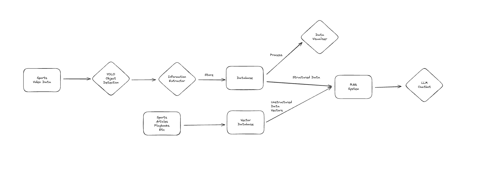

# S.A.V.A.S - Sports Analysis Vision AI System

The aim of this project is to build a sports analyis system using Vision AI with a RAG + LLM chatbot on top of it.
The aim is to showcase my skills in AI models on video data, model development, deployment, RAG-based applications

## High Level Process Flow
